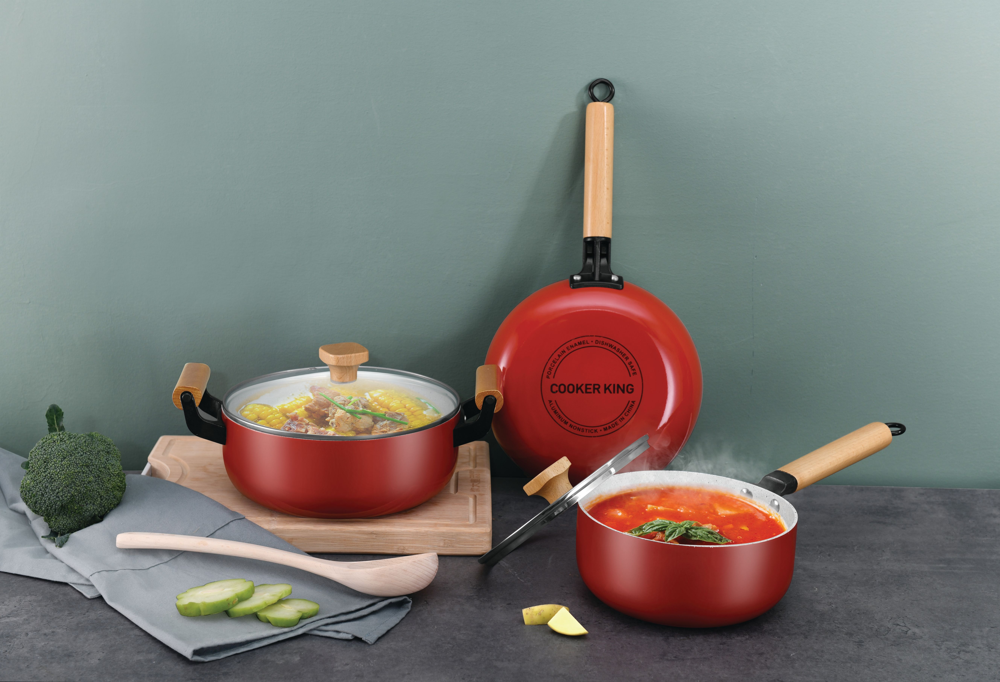

初中生毕业除了走普通高中升学路线，还可以走职教技术提升路线，国家大力支持职教发展，前景可为！专业按性别划分，男生适合学：汽修专业、厨师烹饪、IT技术、电子商务、计算机专业等等；女生适合学：护理专业、会计专业、美容化妆、学前教育等；

## 电子商务专业

中国的电子商务处于高速发展期，人们越来越习惯于在网上购物，已经形成一种新的生态，并且近几年跨境电商发展火爆，所以读电子商务专业是非常有前途的，就业前景也非常广阔。

## 美妆专业

美容化妆主要包含常规化妆、新娘跟妆、影视化妆、特效化妆等；现今化妆技术的应用越来越广，化妆师的发展前景也越来越好，对于喜欢化妆，想从事化妆师行业的爱好者来说，化妆师将是一个不错的职业规划。

## 汽修专业

对于男生来说，汽修专业是不错的选择，职教就业市场倾向于技能型人才，特别是汽修行业；中国大力发展新能源汽车，是一次技术革新，所以说全国汽修行业也变得也来越重要，技术新颖，对于初中毕业生来说，汽修也是一门比较好入门的技术。

## 厨师烹饪专业

厨师烹饪对于喜欢厨艺的初中毕业生来说，是一门非常合适的传统手艺，包含中餐、西餐等，男生女生都可以选择，厨艺学好了就业十分简单，薪酬也是非常可观的。

## 护理专业

护理学专业是当前比较紧缺的专业之一，当前我国经济、医疗水平发展迅速，护理专业人才的需求日益增长，护理专业毕业生就业前景好，不仅国内，国际护理员同样面临着短缺的局面，学习护理专业学习，无论从薪水还是发展前景来看，对女生来说都很不错。

## 设计类专业

从国家提出要发展文化产业开始，设计类、动漫类产业就应运而生；设计系的发展方向很多，初中毕业生可以选择商业设计、UI设计、室内装饰设计或游戏动漫设计等专业，这些专业实用性强，就业前景好。

## 新媒体专业

从广告行业出发，目前信息发布源从传统媒体已经过渡为各大新媒体平台，自媒体个人，新媒体专业的就业前景很好，社会需求大，就业面广；可以从事传统商业媒体、政府网站等的宣传工作，也可以从事网站策划、网络推广以及网站建设与管理等方面的工作。

## IT技术专业

在现代社会中，软件应用于多个方面，科技研发、网络开发、网站建设等等都离不开IT行业，计算机软件开发技术现在很有发展空间，工作待遇也高，关键是初中学历即可学习，学习门槛不高，对英文也没有要求，所以学习IT技术之后的就业前景还是很不错的，好找工作，薪资也不错。

## 数字娱乐专业

目前中国的动漫游戏产业正处于蓬勃发展的阶段，对动漫游戏的专业人才需求量极高；据权威机构统计，全国动漫游戏人才缺口高达百万，创意型和技术型的动漫游戏人才月薪上万依旧难觅，前景很好，零基础学习，就业机会多，工作体面，薪资高。

## 联系我们

### ①学校地址

- 莱西校区：山东省青岛莱西市黄岛路1号
- 高新区校区：青岛市高新区科海路103号
- 城阳校区：青岛市城阳区青霞路51号

### ②联系电话

**孙老师：18563933700（微信同号）**

**边老师：13522070128(微信同号)**

