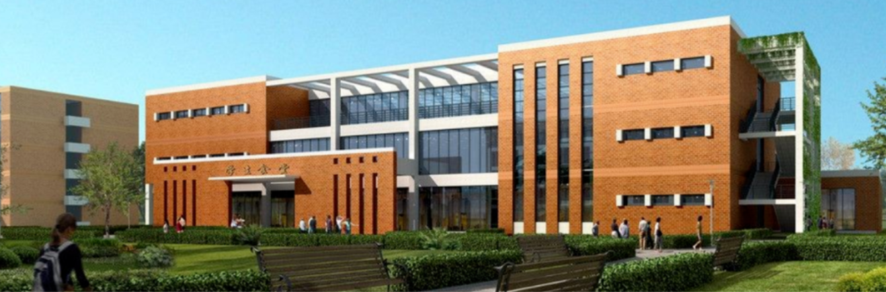
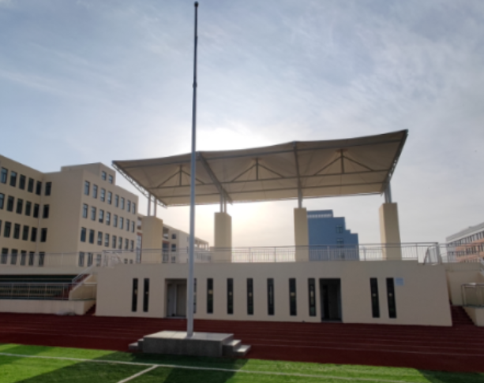
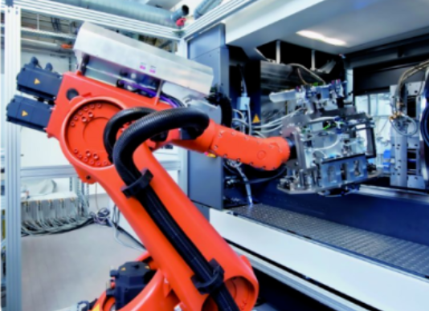
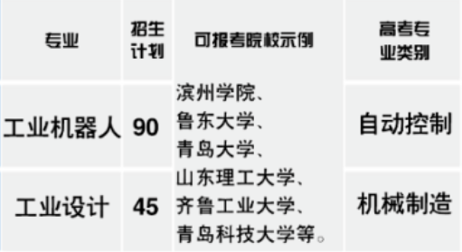
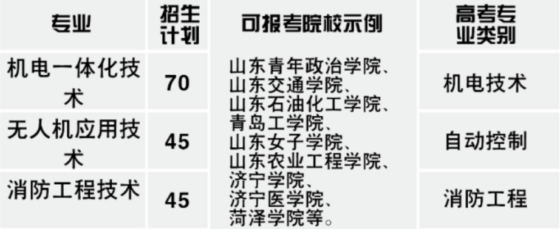
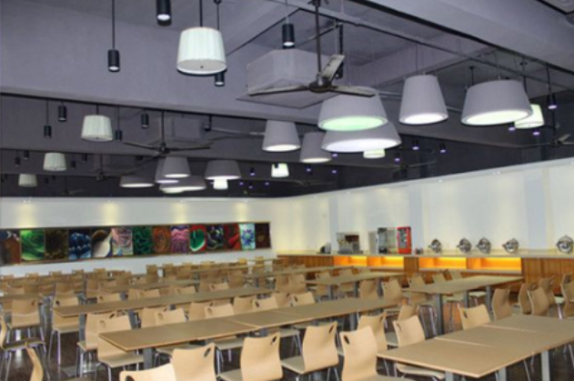

## 01 学校简介

青岛中工技工学校校园是由政府投资建设的一所高起点、高标准，以职教本科升学、高级技能人才培养、高端就业为导向的全日制技工学校。

学校坚持“修德励能，精工匠艺，服务现代化产业体系”的人才培养原则。坚持"工学一体、产教融合、升学为先、就业为本”的办学理念，**办学十八年来，现已发展成青岛市职业技能公共实训基地、青岛市高级技能人才重点培训基地、企业自主评价基地、就业见习基地**。

长期以来坚持靠质量立校，靠特色兴校，靠诚信发展，靠校企合作培养高级人才的强校战略，走创新发展之路，着力打造技工教育品牌名校。学校已全面建设了智能制造专业、现代信息技术专业，集群式开展专业建设，突破了传统专业界限，定制专业、设置新的课程体系,使各专业与群内交叉专业的知识体系有效衔接，无缝对接各技术领域，为企业培养更多高素质、高技能人才。

## 02 办学优势

**师资优势：** “双师型”名师执教。教学管理者是治学严谨的知名职业教育家，主讲教师都是曾在海尔、海信、青特等知名企业工作多年，有着丰富的实践经验的双师型教师。

**教学优势：** 一 体化教学模式。学校采用了理论和实践一体化、边理论边实践的产教融合教学模式。这不仅提高了培训质量而且使理论知识直接指导技能， 并与企业生产接轨。

**硬件优势：** 完备的实训基地。学校有智能制造实训车间、工业机器人实训车间、3D打印实训室、电气自动化实训室、电商设计实训室、直播营销实训室、摄影摄像实训室等供学员实习实训使用。

**专业优势：** 丰富的热门专业。工业机器人应用与维修专业是**山东省省级特色专业之一**， 包含无人机专业、电气自动化技术专业和数控技术专业在内的机电一体化技术专业，是山东省品牌专业群，还开设了护理、幼儿教育、电子商务、消防工程等16个热门专发展多元化发展。

**发展优势：** 学校可通过全国统一的普通高考、职教高考、国际高考、单招考试、定向培养、技能大赛、成人高考等升学深造，**升入专科、本科院校取得大学学历**。学校还与全国多所知名高校联办，使得在学校学习的学生既有技能又有学历。

**就业优势：** 可靠的就业服务。“可靠的就业服务，**100%安置学员就业”这是学校永远的承诺**。学校成立人才服务平台，并有专业人才服务团队为学生从入学到就业全方位提供职业发展规划及培养方案，打通职业教育与产业需求的最后一公里。

## 03 招生专业

|  专业  |  招生计划  |  就业方向  |
| :--: | :--: | :------- |
| 机电一体化 |  70  | 各大企业从事机电一体化设备操作、安装调试，维护维修、现场技术管理 |
| 幼儿教育 |  70  | 在各级各类学前教育机构任幼儿教学工作,并能担任幼儿英语.舞蹈、美术、钢琴等技能的培训和指导 |
| 电子商务 |  90  | 从事电子商务项目管理，互联网产品经理、第三方电子商务平台管理电子商务活动的策划与运作 |
| 护理 |  90  | 在各类医院、康复中心社区医疗服务中心，养老服务中心等从事临床护理，护理管理等工作 |
| 消防工程技术 |  45  | 在设计单位、消防局、大中型事业单位从事研究与开发、工程设计和管理等工作 |
| 新能源汽车检测与维修 |  70  | 从事各种现代汽车的维修、綜合性能的检测、技术管理等工作，操作型或技术类工作 |
| 无人机应用技术 |  45  | 航拍测绘，农林植保，调试维修师，物流企业，安防监控，公安交警，宣传片拍摄，特技表演，消防救援等方向 |
| 数控编程 |  70  | 生产管理、机械产品设计、数控编程与加工操作、数控设备安装、调试与操作、数控设备故障诊断与维修 |
| 眼视光技术 |  45  | 在各级综合性医院、医学院校、眼镜公司担任眼科医师、视光医师和承担眼视光学教学、科研等工作 |
| 口腔义齿制造 |  45  | 口腔义齿加工企业、口腔医院、口腔维护、口腔医师助理等工作 |
| 烹饪(中西式面点) |  90  | 从事大，中型饭店及集团餐饮部门]的技术及管理工作，在中，高等烹饪学校从事教学、科研工作 |
| 中药 |  70  | 在各级医院及医疗机构，制药及药晶经营企业，药品检验部门及医药院校等从事研究开发工作 |
| 工业机器人 |  90  | 从事机器人工作站设计、装调与改造、机器人自动化生产线的设计、应用及运行管理等工作 |
| 工业设计 |  45  | 汽车飞机等制造型企业从事机械外形相关工作广告或传媒公司从事设计相关的工作 |
| 工业互联网与大数据应用 |  70  | 从事工业网络设备与系统的安装、调试、维护。及应用，网络控制系统的技术开发与应用 |
| 美术设计与制作 |  90  | 在装饰公司、房地产公司、建筑公司，软件公司、设计院、电子集团从事设计工作 |

## 04 职教高考政策

### ①本科升学

- 小班制教学:采用小班制教学，每班35人。

- 优先级师资配置:在师资配置.上进行优先级保障，提供技能+文化课强化培养。

- **签订协议:符合条件的学生，入学即签订《入学培养协议》，助力升入全日制本科院校。**

### ②特色升学

特色升学班学习方向是学校针对职教高考开设的方向，课程配置是以参加职教高考作为主要的学习目标。通过有针对性的教学和辅导,学生可以通过职教高考实现自己的大学梦!

- 标准班额教学:每班45人。

- **升学保证:入学即签订《入学协议》，努力冲刺本科，助力升入全日制大专院校。**

### ③高端就业

国有企业或. 上市公司就业，择优选拔安排海外高薪就业让学生通过考试获取毕业证书及国家职业技能等级证书。**学校承诺提供国有企业或上市公司的工作机会**，月收入在8000-12000元。学校选拔优秀毕业生，开设海外就业通道，直接进入海外大型企业就业。

### ④高级技工

依据国家、省、市等对高级技工的各类优惠政策，加强对高级技工的深展教学，激励广大学生走技能成才、技能报国之路，使学生达到“学历+技能"双丰收，锻炼、培养出具有创新能力的高级技工人才。

**从第二学年开始，学校组织安排实习实训**，期间由学校老师全程陪同指导，并对学生的日常生活进行管理和照顾，学生通过实习实训理解企业运行机制，在实践中掌握技能，**企业对学生给予月度5000元到8000元的实训补贴**。同时，对实习实训表现优异的学生，可参加企业对储备管理干部、技术骨干等人才的培养和选拔。

### ⑤国防升学

国防升学班是响应国家政策，落实国家人才战略和加强国家国防力量储备的重要举措。通过相应课程的学习和日常训练，为国家培养-批有信仰、有纪律、有文化、懂专业的高素质部队储备人才。

国防升学班额外强化国防特色课程教育，学习国防知识，培养国防意识。使军人品质通过日常训练、专业课程等融入学生品德中，同学们按照军营的生活模式严格要求自己，淬炼军人精神。

## 05 学校风采

学校位于国家历史文化名城、国家优秀旅游城市、经济中心城市、帆船之都青岛;总占地约210亩，可同时容纳约12000名学生在校就读。校园建筑包括行政教学综合楼、学生宿舍楼、餐厅楼、实训教学楼、标准400米跑道体育场、篮球场、羽毛球场、排球场等，学校建设计划总投资20亿元。

## 06 联系我们

### ①学校地址

- 莱西校区：山东省青岛莱西市黄岛路1号
- 高新区校区：青岛市高新区科海路103号
- 城阳校区：青岛市城阳区青霞路51号

### ②联系电话

**孙老师： 18563933700(微信同号)**

**边老师：13522070128(微信同号)**

